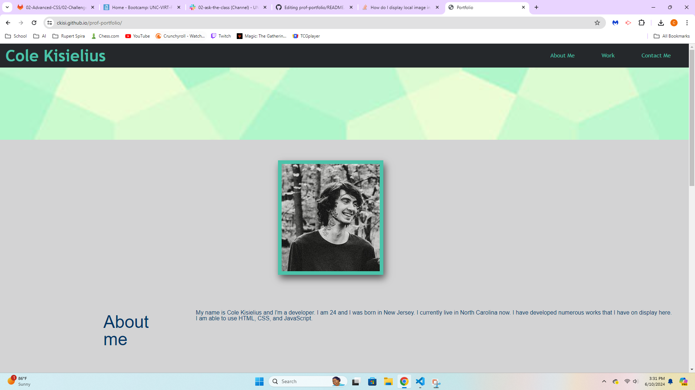
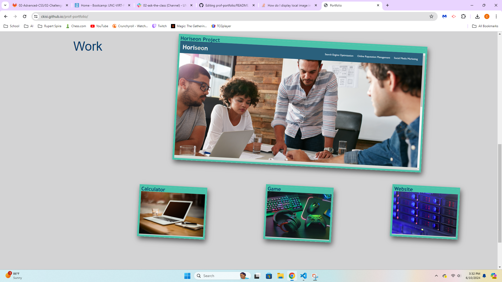
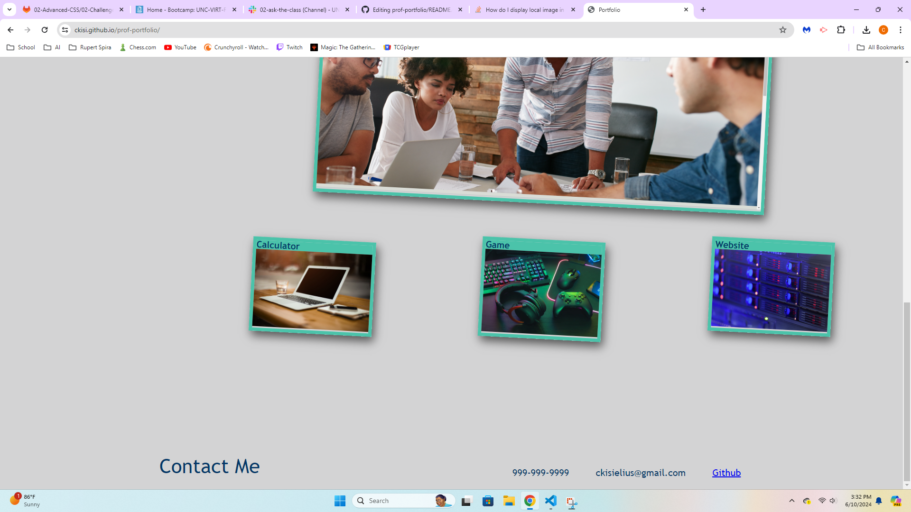

# Professional Portfolio

## Description

This is my portfolio which I made for employers, so that they may see my works and also learn about me. It's intended purpose is to help employers decide whether or not I am a good candidate for a job.

## Usage

The navigation bar at the top leads you to each section depending on what you click. Clicking on the pictures of my work will lead you to their respective work.

## Technologies

HTML and CSS

## Credits

Banner:
https://graphicdesignjunction.com/2014/05/pattern-designs-65-seamless-patterns-for-websites-background/

Stock pictures I used:
https://www.publicdomainpictures.net/en/view-image.php?image=150549&picture=desktop-computer-pc
https://stock.adobe.com/search?k=gaming
https://www.alamy.com/stock-photo/server-rack.html?sortBy=relevant

# Links

https://ckisi.github.io/prof-portfolio/
https://github.com/ckisi/prof-portfolio

# Screenshots

